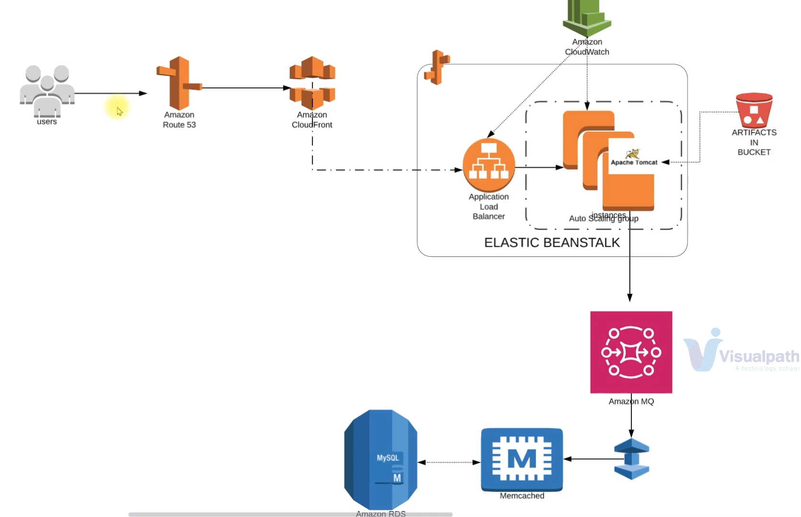
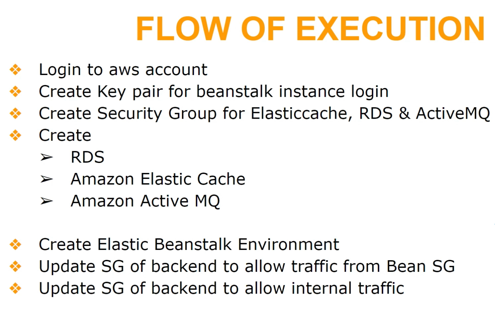
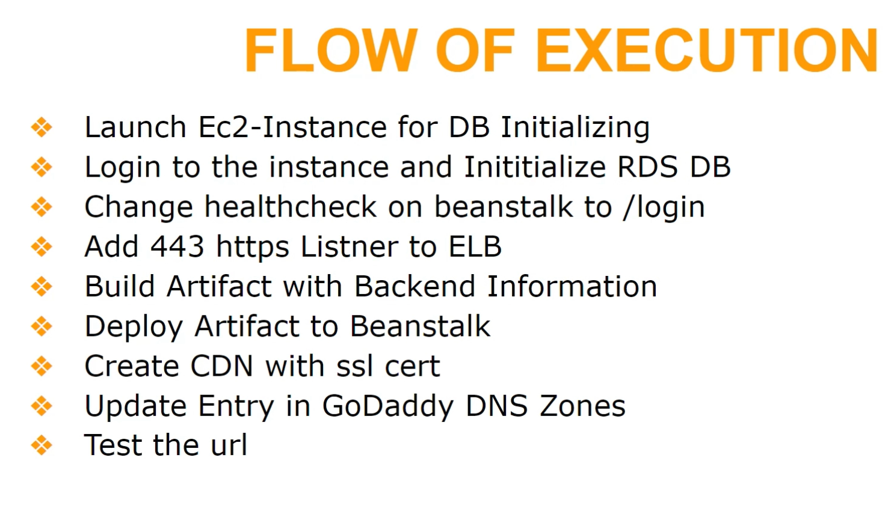

### vprofile project using paas & saas
* Beanstack ---> for app, it will have the below managed resources
    - ec2 for tomcat (app server) with a security group
    - ELB for load balancing with a security group
    - SGs will have the rules added to allow traffic from ALB to ec2 instnaces
    - autoscaling
    - storage (s3 or EFS), can also use custom storage

* RDS instnace ---> for database
* Elastic Cache ---> for Memcached
* Active MQ ---> for Rabbit MQ
* route53 ---> for DNS
* Cloud Front ---> for CDN (content delivery network)

